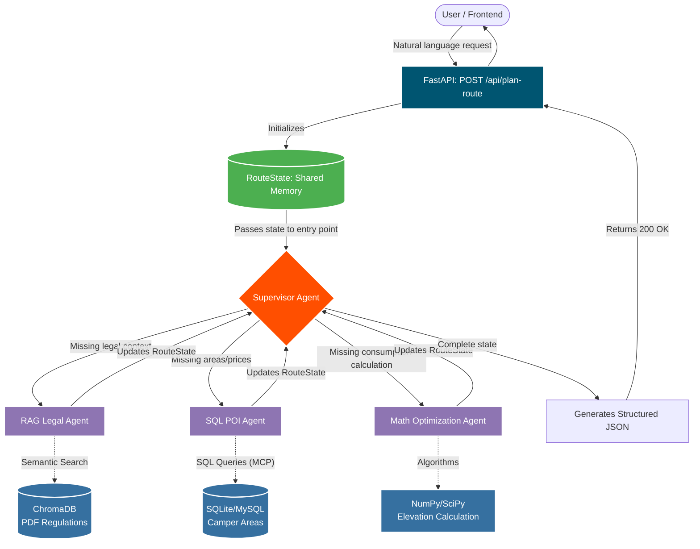

# Camper Agent Orchestrator


A backend application that implements a Hub-and-Spoke multi-agent architecture for campervan route planning. Built with FastAPI and LangGraph, the system orchestrates a central supervisor LLM that dynamically delegates tasks to specialized sub-agents to resolve legal constraints, locate points of interest, and optimize fuel costs.

## How it works
The orchestration loop relies on a shared `RouteState`. The Supervisor agent evaluates the state at each iteration and routes execution to the corresponding tool until all required data is populated.



## Core Components

- **Supervisor Agent**: The central decision-maker. It relies on a deterministic prompt and Pydantic structured outputs to evaluate the RouteState missing fields and trigger conditional routing.

- **SQL POI Agent**: Interfaces with a relational database to fetch viable overnight parking locations matching user constraints (e.g., electricity hookups).

- **RAG Legal Agent**: Uses semantic search over a vector store to retrieve local regulations regarding campervan parking and overnight stays for the targeted regions.

- **Math Agent**: Handles numerical processing for fuel cost estimations and driving time optimizations based on distance and vehicle consumption.

## Setup & Deployment

1. Clone the repository and navigate to the project root.
2. Create a `.env` file in the root directory to store your credentials:
```env
GEMINI_API_KEY=your_api_key_here
```

3. Build the Docker image:
```bash
docker build -t camper-agent-orchestrator .
```

4. Run the container:
```bash
docker run -d --name camper-api -p 8000:8000 --env-file .env camper-agent-orchestrator
```

## Usage
Send a POST request to the API to trigger the graph execution. The graph will loop until the Supervisor resolves all missing data and compiles the final itinerary.

```bash
curl -X POST "http://localhost:8000/api/route" \
     -H "Content-Type: application/json" \
     -d '{
           "origin": "Málaga",
           "destination": "Sagres",
           "max_driving_hours_per_day": 4,
           "requires_hookups": true,
           "preferences": ["coastal"]
         }'

```

## Evaluation Suite

`evals/` is a small custom eval harness (not pytest — see module docstrings for why) that runs 5 golden route cases end-to-end against the real graph, asserting on the Python-computed state (`math_analysis`, `itinerary_legs`, `legal_region`), never on the LLM's free-text narrative:

```bash
python -m evals.run_evals                         # full dataset
python -m evals.run_evals --case short_same_region # a single case
```

This makes real Gemini/Nominatim/OSRM calls and consumes real free-tier LLM quota — it's a correctness check, not a fast unit-test suite.

## Known Limitations & Trade-offs

This project intentionally runs on Gemini's **free tier** (`gemini-flash-lite-latest`) as a portfolio/cost decision, not a technical one. That choice has one concrete, measured consequence worth calling out explicitly rather than leaving for someone to rediscover and mistake for a bug:

**The free tier's per-minute request quota (15 RPM) can be lower than what a single request needs.** Every `/api/route` call makes at least 4 Gemini calls (the supervisor fires once per hub visit). When a trip is infeasible in one leg, the system automatically re-plans by splitting it into sub-legs (bounded by `MAX_LEGS`) — each additional leg adds another supervisor round-trip, and a "guard clause" that forces a re-route whenever the LLM tries to end a leg prematurely can add several more on top of that. Measured on this repo's own eval dataset:

| Legs in the final itinerary | Gemini calls observed |
|---|---|
| 1 (no split) | 4 |
| 2 | 10 |
| 3 | 16 |
| 4 (`MAX_LEGS`, worst case) | 20+ — reliably exceeds the 15 RPM cap |

The adversarial eval case designed to force the maximum number of splits (`extreme_infeasible_after_split` in `evals/dataset.py`) fails with a `429 RESOURCE_EXHAUSTED` from Gemini even when run in isolation with a fully-reset quota window — it needs more calls than the free tier allows in the time it takes the graph to make them. The eval harness reports this as an **ERROR**, distinct from a **failed check**: the routing logic, feasibility math, and region resolution are all correct in every case that *does* get to run (12/12 checks passed across the other 4 cases) — this is a rate-limit ceiling, not a logic defect.

**Why this is left as-is:** upgrading to a paid Gemini tier, or reworking the routing to need fewer LLM calls, would defeat the point of this being a free, self-contained portfolio project. The honest trade-off is: this architecture is correct and demonstrable on the free tier for realistic trips (0-3 splits), and its own eval suite is what surfaces the exact point where free-tier quota — not the agent design — becomes the bottleneck.

Related, smaller constraints from the same "free/public services, no keys" decision: Nominatim (geocoding) enforces ~1 req/s and the OSRM demo server used for routing isn't meant for production load. Both are fine at this project's traffic level; see `app/agents/math_agent.py` and `CLAUDE.md` for details.

## Copyright and License
This project is open-source software licensed under the MIT License.
