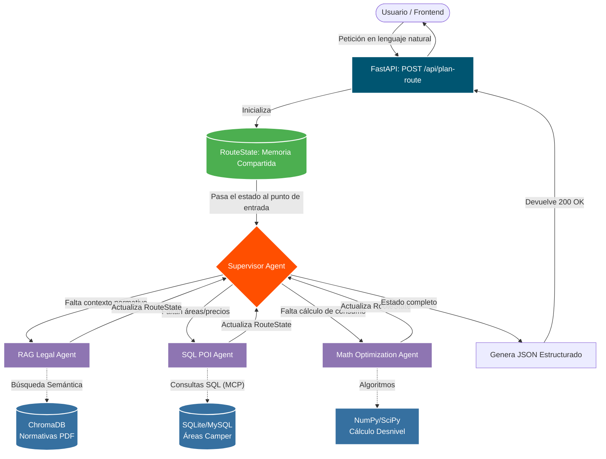

# Camper Agent Orchestrator

## How it works

```mermaid
flowchart TD
    %% Estilos
    classDef api fill:#005571,stroke:#fff,stroke-width:2px,color:#fff;
    classDef agent fill:#8E75B2,stroke:#fff,stroke-width:2px,color:#fff;
    classDef supervisor fill:#FF4F00,stroke:#fff,stroke-width:2px,color:#fff;
    classDef tools fill:#3670A0,stroke:#fff,stroke-width:2px,color:#fff;
    classDef state fill:#4CAF50,stroke:#fff,stroke-width:2px,color:#fff;

    %% Nodos de entrada
    Client([Usuario / Frontend])
    Endpoint[FastAPI: POST /api/plan-route]:::api
    
    %% Grafo y Estado
    State[(RouteState: Memoria Compartida)]:::state
    
    %% Agentes (Nodos de LangGraph)
    Supervisor{Supervisor Agent}:::supervisor
    RagAgent[RAG Legal Agent]:::agent
    SqlAgent[SQL POI Agent]:::agent
    MathAgent[Math Optimization Agent]:::agent
    
    %% Herramientas
    Chroma[(ChromaDB\nNormativas PDF)]:::tools
    SQLDB[(SQLite/MySQL\nÁreas Camper)]:::tools
    SciPy[NumPy/SciPy\nCálculo Desnivel]:::tools

    %% Flujo de ejecución
    Client -- "Petición en lenguaje natural" --> Endpoint
    Endpoint -- "Inicializa" --> State
    State -- "Pasa el estado al punto de entrada" --> Supervisor
    
    %% Enrutamiento Cíclico
    Supervisor -- "Falta contexto normativo" --> RagAgent
    Supervisor -- "Faltan áreas/precios" --> SqlAgent
    Supervisor -- "Falta cálculo de consumo" --> MathAgent
    
    %% Uso de herramientas
    RagAgent -. "Búsqueda Semántica" .-> Chroma
    SqlAgent -. "Consultas SQL (MCP)" .-> SQLDB
    MathAgent -. "Algoritmos" .-> SciPy
    
    %% Retorno al estado y supervisor (El bucle de LangGraph)
    RagAgent -- "Actualiza RouteState" --> Supervisor
    SqlAgent -- "Actualiza RouteState" --> Supervisor
    MathAgent -- "Actualiza RouteState" --> Supervisor
    
    %% Salida
    Supervisor -- "Estado completo" --> Final[Genera JSON Estructurado]
    Final -- "Devuelve 200 OK" --> Endpoint
    Endpoint --> Client
```
